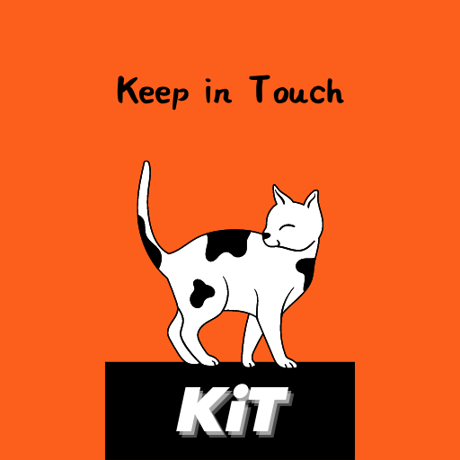

## Project Description

Keep in Touch is an app focused on helping young people who forget to respond to texts to **_keep in touch_**. Keep in Touch, also known as KiT, helps forgetful users and people that forget to nurture their relationships due to the busyness of modern life. KiT directly aids users that struggle with anxiety to make it past "texting small-talk" when exchanging numbers with a new connection by prolonging conversations and interactions, via seamless reminders to "keep in touch." If three days have passed since the last message, KiT nudges users to text back. Over time, these continual nudges in the right direction can blossom fresh friendships and nourish unlikely connections. Moreover, KiT also doubles as an app for forgetful family members so that they can simply _keep in touch_ with one another. Say goodbye to poor communication and say hello to actually checking in with one another. 

KiT accomplishes this by using text message metadata from inbound and outbound messages and corresponding phone contacts. It utilizes the built in messages app in Android to send short  _keep in touch_ messages to friends and family. When a user first downloads the app and signs in via Google, they can select a preferred user-type based on user demographic information. Once completed each user will have access to smart auto-replies to your contacts, and a more catered experience.

KiT intends to make it easier to reply to contacts, who've already messaged you. The purpose of KiT is to make responding back effortless.
The implications of what this app allows are interesting, because it can change how people communicate through SMS in the real world. During the Covid-19 Pandemic,
we've all experienced the way that communication suffers. KiT aims to alleviate the natural issue that arise from SMS communication, continuity. Currently, most native
text messaging apps don't have a reminder feature built in. Even if they did, users may be reluctant to send a message unless it's effortless. Lately, services like Gmail
have offered similar functionality, but there's no app that reminds different user groups for SMS messaging.  

### Key features

* Ignore contact 
    > Allows the user to not be reminded to message a contact back. After three confirmed ignores, the app will not nudge the user until the user overrides the ignore.
    
* Selection of user-type specified auto-replies
    > Allows users to gain access to specified auto-replies based on the user-type selected when they first download the app. This will be functional even if the context-based auto-replies does not offer a poignant reply. 
    
* KiT reminder duration
    > Allows the user to select the duration of time allotted to pass between sender and receiver before prompting the user to KiT their contact back.
    
* Different KiT themes
    > Customize the feel of your KiT experience with a Dark Theme, Light Theme, Cat Theme, or Dog Theme.

## [Intended Users](work/intendedUsers.md)

## [Cloud or device-based services & data](work/deviceServices.md)

## [Wireframe](work/wireframe.md)

## [Entity-Relationship Diagram](work/entityRelationshipDiagram.md)

## [Entity Classes](https://github.com/Shayan96505/keep-in-touch/tree/master/app/src/main/java/edu/cnm/deepdive/keepintouch/model/entity)

## [DAO Interfaces](https://github.com/Shayan96505/keep-in-touch/tree/master/app/src/main/java/edu/cnm/deepdive/keepintouch/model/dao)

## [Kit Database](https://github.com/Shayan96505/keep-in-touch/blob/master/app/src/main/java/edu/cnm/deepdive/keepintouch/service/KitDatabase.java)

## [Repositories](https://github.com/Shayan96505/keep-in-touch/tree/master/app/src/main/java/edu/cnm/deepdive/keepintouch/service)

## [DDL](ddl.md)

