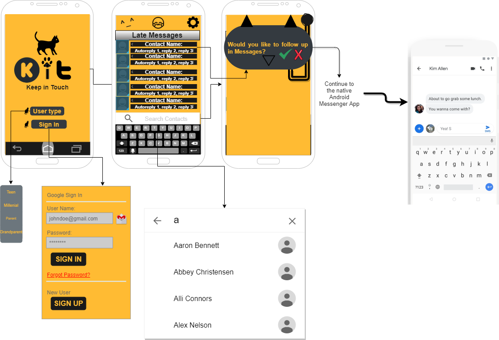
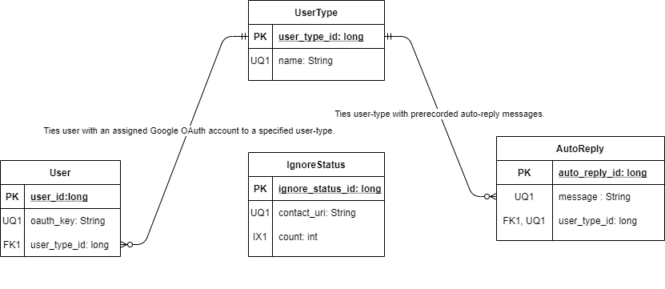

## Project Description

This app is focused on helping young people who forget to respond to texts to **_keep in touch_**. Keep in Touch, also known as KiT, helps forgetful users and people that forget to nurture their relationships due to the busyness of modern life. KiT directly aids users that struggle with anxiety to make it past "texting small-talk" when exchanging numbers with a new connection by prolonging conversations and interactions, via seamless reminders to "keep in touch." If three days since the last message have passed, KiT nudges our users to text back. Over time, these continual reminders can blossom fresh friendships and unlikely connections, that may have otherwise died. KiT also doubles as an app for forgetful family members so that they can simply _keep in touch_ with one another.

KiT accomplishes this by utilizing text message metadata from inbound and outbound messages and corresponding phone contacts. It will utilize the built in messages app in Android to send short  _keep in touch_ messages to friends and family.

### Key features

* Ignore contact 
    > Allows the user to not be reminded to message a contact back. After three confirmed ignores, the app will not nudge the user until the user overrides the ignore.
* Selection of user-type specified auto-replies
    > Allows users to gain access to specified auto-replies based on the user-type selected when they first download the app

## Intended Users

## KiT users

#### Teens

> As a teen, I want to make sure I don't forget to text my friends back so that  I can stay connected with what's going on and foster my friendships.

> As a teen with anxiety, I don't want to miss out. Kit will help me step past the "over-thinking" in my head, so that I can stay connected digitally and let my friends know how I'm doing.

#### Millenials 
<!--- | -->

 Young Professionals | College Graduate
--- | ---
 | 

<!--- {width=50%} |  -->

> As a  millienial, I want to respond to my friends, acquaintances, and work connections in a timely manner to build my social network and create deeper and more meaningful connections with the individuals I've met throughout my life. This app will help me for the times I become too forgetful or busy.

#### Parents 

> As a forgetful parent, I want to check in on my family more often to make sure they have everything they need. By using KiT, I wont have to worry if I forget about them when work or taking care of my younger kids gets hectic, because I'll be reminded to send a _**KiT**_.

#### Grandparents 

> As a grandparent, I want to let my family know that I'm okay every so often. However, I can't navigate apps. I want a basic app that helps me _keep in touch_, so my family doesn't worry about me, but also remembers to call me back.

## Functionality

* Upon download, users will select a user profile type, teenager, millenial, parent, grandparent which autofills the app with a
default profile and default _KiT_ messages based on their user profile type.
	* Some settings will include:
		* KiT reminder duration
		* KiT preset responses-- utilizing ML Kit's Smart Reply
		* different KiT themes-- Dark Theme, Light Theme
		* When/if the ML Kit's Smart Reply feature/ service doesn't work, this app will be able to function on its own
		with some preset, hard-coded messages courtesy of moi.
		
		

* User will power on phone and get notified within 5 minutes of boot-up with a list of contacts they haven't messaged back. These notifications will be based on **KiT** reminder duration, that is specified by their user profile data. Default will be to auto-prompt a reply if there hasn't been a text exchange in three days or greater.

* User will then be prompted either to send a quick, check-in message.  _Ex. " How are you, sorry I forgot to respond."_

* From there the user will be guided to the native android messenger where they can send additional responses and follow up about the previous day's messages.

* Additionally, there will be a check-mark option in the settings menu for anxious people, that auto-sends their friends a short message talking a little about how anxious they've been feeling and then following up, by asking the friend how they are doing. This method incorporates the mechanism of _"prolonged and repetitive exposure"_ to fears to eventually help anxious users move past their social-anxiety over time.
	* Example message: _"Hey, sorry for not responding. I've been feeling anxious. How have you been doing lately? I want to follow up on our last messages ..."_

## Device/external services

Client component will need access to special services including: 

* contacts
* messaging
* text message metadata
* I'm considering hard-coding string options, if I can't find a good API.

This may work though: [Smart Reply Machine Learning Kit](https://developers.google.com/ml-kit/language/smart-reply/android),
technically this would be on-device, so it may not count as an external service.

<!--- 
I still may scrape some greetings off of [this website](https://preply.com/en/blog/22-useful-english-greetings-for-every-day/#scroll-to-heading-18). --->

## Stretch goals and possible enhancements 

I would like to implement some of the stretch features of this app, on at least a _barebones_ level, for one social media platform. Hopefully, it will be for a commonly used one like FB messenger. At a barebones level in another app, I would just like to prompt a user to "KiT" message a friend on Facebook if a certain amount of time has passed since they last messaged each other, that's it.

* Other possible platform implementations
	* KiT implementation on Facebook Messenger
	* KiT implementation on WhatsApp
	

* Other potential features to be implemented on KiT:
	* KiT favorite contacts (Similar to T-mobile fave-five)
	* A feature that texts their friends who text them while they're away on vacation about when they'll get back to them. 
	* An ignore option to ignore messaging a particular person back, if they **ignore** a contact 3 times in a row, no more notifications will pop-up reminding the user to "KiT" the contact they ignored 3 times. This list of contacts can be overrode in the settings menu at a later time.
	* KiT motivational quotes selection in app.
	* Dog Theme for those who love their "woof"-ers

## Wireframe

#### Keep in Touch Android App Layout

## Entity-Relationship Diagram

#### Persistent Device Data Modeling
