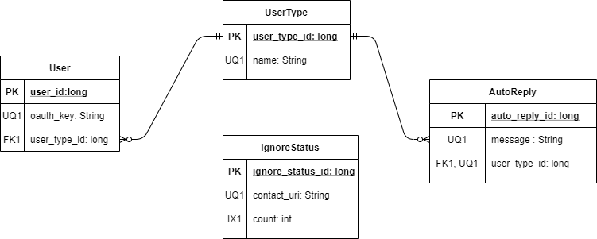

## Project Description

This app is focused on helping young people who forget to respond to texts to **_keep in touch_**. Keep in Touch, also known as KiT, helps forgetful users and those who forget to nurture their relationships amidst the busyness of modern life and multitasking. KiT directly aids users that struggle with anxiety to make it past "texting small talk" when exchanging numbers with a stranger, by prolonging conversations and interactions, via seamless reminders to "keep in touch," after three days have passed. Over time these continual reminders can blossom fresh friendships and unlikely connections, that may have died out. KiT also doubles as an app for forgetful family members so that they can simply _keep in touch_ with one another.

KiT relies on text message metadata from received and sent messages and corresponding phone contacts, to nudge a user to auto-reply. It will utilize the built in messages app in Android to send short  _keep in touch_ messages to friends and family.

## Bullet list of functionality

## [Intended Users](intendedUsers.md "Redirect to Intended Users")

#### Teens

#### Millenials 

#### Parents 

#### Grandparents 

## Functionality

* Upon download, users will select a user profile type, teenager, millenial, parent, grandparent which autofills the app with a
default profile and default _KiT_ messages based on their user profile type.
	* Some settings will include:
		* KiT reminder duration
		* KiT preset responses-- utilizing ML Kit's Smart Reply
		* different KiT themes-- Dark Theme, Light Theme
		* When/if the ML Kit's Smart Reply feature/ service doesn't work, this app will be able to function on its own
		with some preset, hard-coded messages courtesy of moi.
		
		

* User will power on phone and get notified within 5 minutes of boot-up with a list of contacts they haven't messaged back. These notifications will be based on **KiT** reminder duration, that is specified by their user profile data. Default will be to auto-prompt a reply if there hasn't been a text exchange in three days or greater.

* User will then be prompted either to send a quick, check-in message.  _Ex. " How are you, sorry I forgot to respond."_

* From there the user will be guided to the native android messenger where they can send additional responses and follow up about the previous day's messages.

* Additionally, there will be a check-mark option in the settings menu for anxious people, that auto-sends their friends a short message talking a little about how anxious they've been feeling and then following up, by asking the friend how they are doing. This method incorporates the mechanism of _"prolonged and repetitive exposure"_ to fears to eventually help anxious users move past their social-anxiety over time.
	* Example message: _"Hey, sorry for not responding. I've been feeling anxious. How have you been doing lately? I want to follow up on our last messages ..."_

## Persistent data

* Last messaged date
* Contact Info
* Incoming/ Outcoming text metadata
* Ignores/ Ignored contacts
* Generic KiT messages and auto-reply message templates

    
## Device/external services

Client component will need access to special services including: 

* contacts
* messaging
* text message metadata
* I'm considering hard-coding string options, if I can't find a good API.

This may work though: [Smart Reply Machine Learning Kit](https://developers.google.com/ml-kit/language/smart-reply/android),
technically this would be on-device, so it may not count as an external service.

<!--- 
I still may scrape some greetings off of [this website](https://preply.com/en/blog/22-useful-english-greetings-for-every-day/#scroll-to-heading-18). --->

## Stretch goals/possible enhancements 

I would like to implement some of the stretch features of this app, on at least a _barebones_ level, for one social media platform. Hopefully, it will be for a commonly used one like FB messenger. At a barebones level in another app, I would just like to prompt a user to "KiT" message a friend on Facebook if a certain amount of time has passed since they last messaged each other, that's it.

* Other possible platform implementations
	* KiT implementation on Facebook Messenger
	* KiT implementation on WhatsApp
	

* Other potential features to be implemented on KiT:
	* KiT favorite contacts (Similar to T-mobile fave-five)
	* A feature that texts their friends who text them while they're away on vacation about when they'll get back to them. 
	* An ignore option to ignore messaging a particular person back, if they **ignore** a contact 3 times in a row, no more notifications will pop-up reminding the user to "KiT" the contact they ignored 3 times. This list of contacts can be overrode in the settings menu at a later time.
	* KiT motivational quotes selection in app.
	* Dog Theme for those who love their "woof"-ers

## Wireframe

#### Keep in Touch Android App Layout

## Entity-Relationship Diagram

#### Persistent Device Data Modeling
