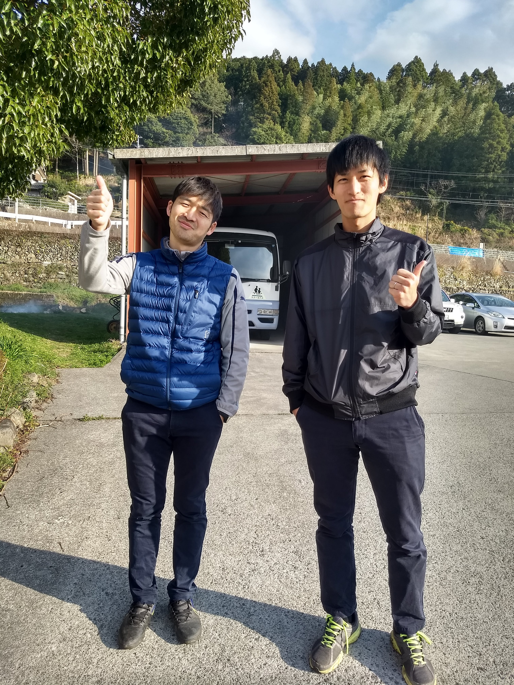
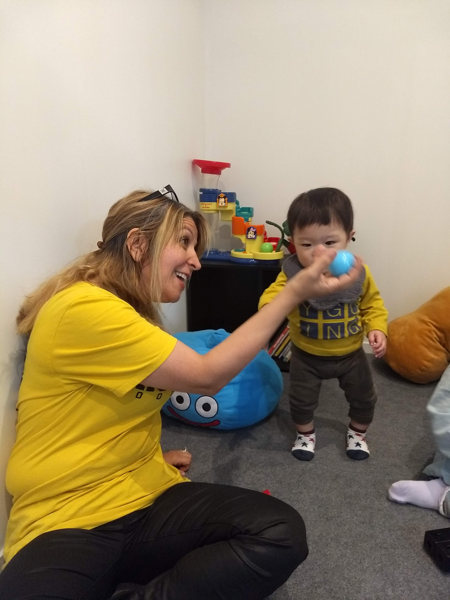

## KiT users

#### Teens

> As a teen, I want to make sure I don't forget to text my friends back so that  I can stay connected with what's going on and foster my friendships.

> As a teen with anxiety, I don't want to miss out. Kit will help me step past the "over-thinking" in my head, by nudging me with reminders. So that I can stay connected digitally and let my friends know how I'm doing. That way they can check up on me in real life.

#### Millennials

 Young Professionals | Recent College Graduates
--- | ---
 | 

> As a young professional, I want to respond to my friends, acquaintances, and work connections in a timely manner so I can build my social network and create deeper, more meaningful connections with the people I've met.

> As a recent college graduate, I can barely handle \#adulting. I want an easy way to review all my old messages in a glance, to make sure I didn't forget to message my friends back. That way I can stay on top of my messages while I learn how to manage paying bills, cooking, and \#adulting. 

#### Parents 

> As a forgetful parent, I want to check in on my family more often to make sure they have everything they need. By using KiT, I wont have to worry if I forget about them when work or taking care of my younger kids gets hectic, because I'll be reminded to send a _**KiT**_.

#### Grandparents 

> As a grandparent, I want to let my family know that I'm okay every so often. However, I can't navigate apps. I want a basic app that helps me _keep in touch_, so my family doesn't worry about me, but also remembers to call me back.